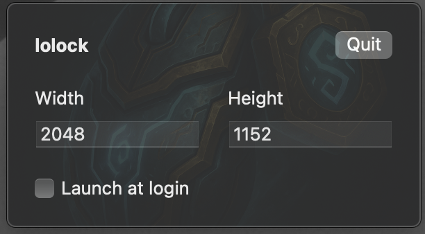

# archive update

Riot has fixed the "software" mouse on macos. This app is no longer required and this repo is being archived. Use the "software mouse" setting in League instead.

# lolock

Lock the mouse cursor inside League of Legends when using multiple displays on macOS.

[Download latest release here](https://github.com/kjjd84/lolock/releases)
